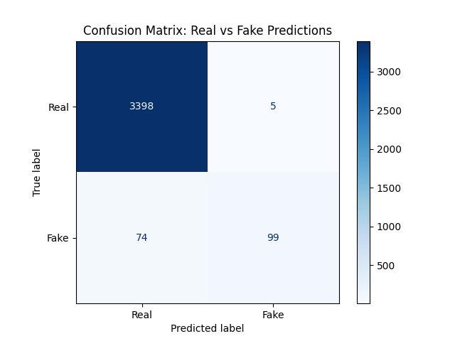

# 🛡️ Fake Job Posting Detection System


## 📌 The Business Problem
Fake job postings are a critical issue for online recruitment platforms. They damage user trust, facilitate identity theft, and waste valuable time for job seekers.

**The Core Challenge:**
This dataset is **highly imbalanced**. Only **4.8%** of the job postings are fraudulent. A standard model could achieve **95% accuracy** simply by guessing "Real" every time, but it would fail to catch a single scammer.

**Our Mission:**
To build an intelligent system that prioritizes **Safety (Recall)** and **Trust (Precision)** over raw accuracy, ensuring that fraudulent postings are flagged before they harm users.

---

## 💡 The Solution
I engineered an end-to-end Machine Learning pipeline designed specifically for imbalanced text data.

* **The Engine:** A **Random Forest Classifier** optimized for the **F1-Score** rather than accuracy.
* **The Innovation:** A custom **NLTK-based text cleaning pipeline** that removes "noise" (stopwords, HTML tags) to isolate specific scammer linguistic patterns (e.g., "investment," "wire transfer").
* **The Interface:** A user-facing **Streamlit Dashboard** ("The Captain's Bridge") that provides real-time risk assessments and warning flags for high-risk postings.

---

## ⚙️ Technical Architecture (The Engine Room)

This project moves beyond standard "tutorial" approaches by implementing a robust, production-grade pipeline.

### 1. The Tech Stack
* **Core:** Python 3.9+
* **Data Manipulation:** Pandas, NumPy
* **Machine Learning:** Scikit-Learn (Pipeline, GridSearchCV, RandomForestClassifier)
* **NLP Engineering:** NLTK (Stopwords, Lemmatization), Regex
* **Deployment:** Streamlit, Joblib

### 2. The Custom Preprocessing Pipeline
Standard vectorization failed to capture subtle scam cues because they were drowned out by "noisy" English words. I refactored the pipeline to include a custom engineering step:

1.  **Custom Text Cleaning (NLTK):** A dedicated function removes HTML tags, non-alphanumeric characters, and stopwords *before* vectorization. This amplified the signal of words like "investment" and "wire transfer."
2.  **TF-IDF Vectorization:** Converts the cleaned text into a numerical matrix (Top 5,000 features).
3.  **Imbalance Handling:** The model uses `class_weight='balanced'` to automatically adjust penalties, treating the rare "Fake" class as 20x more important than the "Real" class.

---

## 📊 Results & Analysis (The Evidence)

Our "Race Car" model (Random Forest) was tuned using `GridSearchCV` to optimize for the **F1-Score**, successfully overcoming the 4.8% class imbalance.

### 1. Final Model Performance
| Metric | Score (Class 1: Fake) | Interpretation |
| :--- | :--- | :--- |
| **Precision** | **0.98** | **Extremely High.** When the model flags a job as "Fake," it is 98% likely to be correct. We rarely falsely accuse legitimate companies. |
| **Recall** | **0.54** | **Moderate.** The model catches 54% of all fake jobs. It prioritizes certainty over catching every single instance. |
| **F1-Score** | **0.71** | **Strong.** A balanced score that proves the model is far superior to a baseline "dummy" classifier (which would have an F1 of 0.0). |

### 2. Visual Proof: The Confusion Matrix
The heatmap below visualizes the model's decision-making process on the unseen Test Set.



### 3. Strategic Trade-off (Rule 23 Analysis)
Our analysis reveals a deliberate engineering trade-off:
* **The Win:** We achieved **98% Precision**. This is critical for a user-facing platform. Falsely flagging a real company as "Fraudulent" destroys user trust and invites lawsuits.
* **The Cost:** We accept a lower Recall (54%). Some subtle scams slip through, but our **Streamlit Dashboard** mitigates this by flagging "suspicious" jobs (20%+ risk) even if the model doesn't fully commit to a "Fake" label.

---

## 🚢 The "Captain's Bridge" (Streamlit App)

The project includes a fully functional web application for end-users.

* **Risk Meter:** Instead of a binary Yes/No, the app calculates a **Probability Risk Score**.
* **Safety Threshold:** We implemented a strict safety threshold. Any job with a **Risk Score > 20%** triggers a warning, ensuring that even "borderline" scams are flagged for manual review.

---

## 🚀 How to Run the Project

Follow these steps to replicate the analysis or launch the dashboard.

### 1. Clone the Repository
```bash
git clone [https://github.com/YOUR_USERNAME/p3-job-fraud-classification.git](https://github.com/YOUR_USERNAME/p3-job-fraud-classification.git)
cd p3-job-fraud-classification


Bash

# Install Python libraries and download NLTK resources in one go
pip install -r requirements.txt && python -c "import nltk; nltk.download(['wordnet', 'stopwords'])"
3. Run the Dashboard
Bash

streamlit run scripts/app.py

To retrain the model from scratch using the training script:

Bash

python scripts/train.py
📂 Project Structure
├── data/                   # Raw dataset (fake_job_postings.csv)
├── notebooks/              # EDA Prototyping (01-initial-eda.ipynb)
├── results/                # Saved Models (.pkl) and Visuals (.png)
├── scripts/                # Production Code
│   ├── app.py              # Streamlit Dashboard
│   ├── data_processing.py  # Custom Preprocessing Engine
│   ├── evaluate.py         # Evaluation Logic
│   └── train.py            # Model Training Pipeline
├── requirements.txt        # Project Dependencies
└── README.md               # Project Documentat